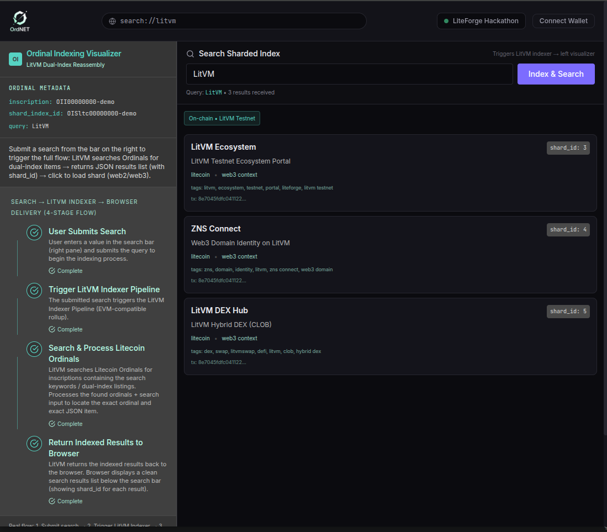
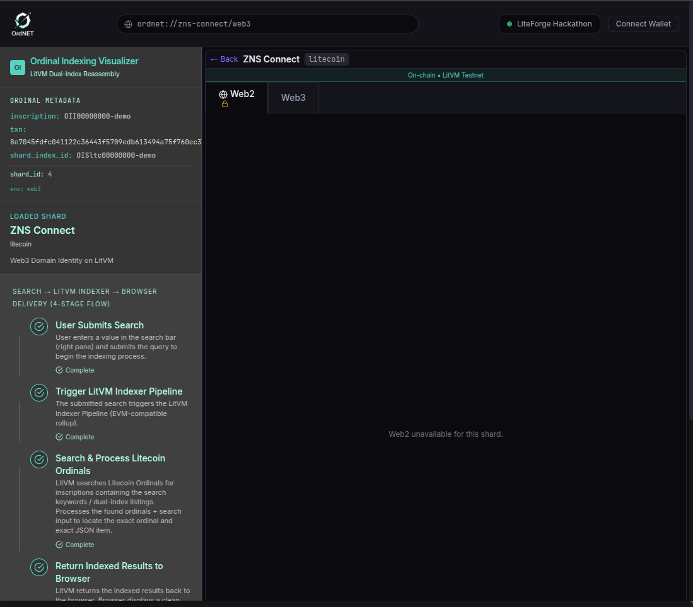
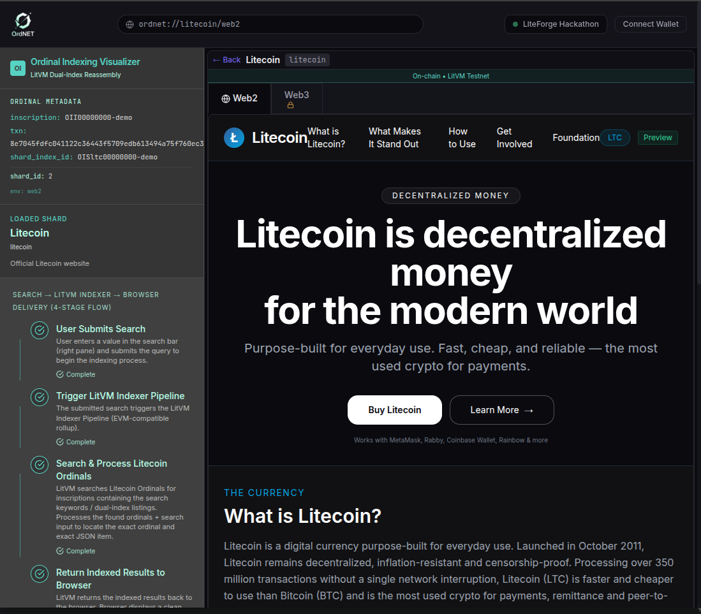

# OrdNET — Universal Sharded Browser

**A functional sharded browser that indexes and searches real Litecoin Ordinals on LitVM Testnet.**

OrdNET demonstrates a practical approach to sharded web browsing by combining on-chain indexing with a clean, wallet-connected frontend. It queries a live smart contract (`OrdinalReassemblerV2`) deployed on LitVM Testnet to fetch, search, and display real ordinal shard data.

## Live Demo

🔗 **[https://ordnet.vercel.app/](https://ordnet.vercel.app/)**

> Currently deployed on Vercel with the latest production build.

## What It Does

- Searches and retrieves real ordinal shards stored on a LitVM smart contract
- Supports full-text search and inscription-based lookups against live on-chain data
- Displays shard metadata including web2/web3 URLs, descriptions, and browser tab preferences
- Connects to external wallets and includes an embedded read-only wallet mode
- Visualizes the indexing and retrieval flow in a clean multi-panel interface

## Key Features

- **Real On-Chain Data** — All shard data comes directly from a deployed `OrdinalReassemblerV2` contract on LitVM Testnet
- **Live Search** — Full-text search and `getShardsByInscription` queries executed on-chain
- **Wallet Integration** — Supports external wallets via Wagmi + embedded read-only wallet
- **PWA Ready** — Progressive Web App with service worker and offline capabilities
- **Clean Architecture** — Separated concerns between contract interaction, normalization, and UI

## Tech Stack

| Layer          | Technology                          |
|----------------|-------------------------------------|
| Frontend       | React 18 + TypeScript + Vite        |
| Styling        | Tailwind CSS                        |
| Web3           | ethers.js, Wagmi, Viem              |
| Smart Contract | Solidity (OrdinalReassemblerV2)     |
| Network        | LitVM Testnet                       |
| Deployment     | Vercel + GitHub                     |
| PWA            | Vite PWA Plugin                     |

## How It Works

1. User submits a search query from the right panel
2. Frontend calls `search()` or `getAllShards()` on the live LitVM contract
3. Results are normalized and rendered in the central results area
4. Shard metadata (URLs, descriptions, lock status, search tags) is displayed in the left visualizer panel
5. Users can connect wallets or use the embedded read-only preview wallet

## Contract Information

- **Network**: LitVM Testnet
- **Contract Address**: `0xb630553212ffF7bFb4d1f536B940F302Cd0C7cB0`
- **Contract Name**: `OrdinalReassemblerV2`

The contract exposes the following key view functions:
- `getAllShards()`
- `search(string query)`
- `getShardsByInscription(string inscriptionId)`

## On-Chain Data Source

All shard data used in OrdNET is stored in a real Litecoin Ordinal inscription.

- **Ordinal Inscription**: [View on OrdLiteverse](https://ordliteverse.com/inscription/8e7045fdfc041122c36443f5709edb613494a75f760ec318de911555bb1bfb78i0)
- **Inscription Transaction**: `8e7045fdfc041122c36443f5709edb613494a75f760ec318de911555bb1bfb78i0`

The inscribed JSON contains the full dual-index (Web2 + Web3) for 5 shards. This JSON is fetched and indexed by the off-chain indexer and stored on the `OrdinalReassemblerV2` contract on LitVM Testnet.

**Example of the inscribed JSON** (abbreviated):

```json
{
  "meta": {
    "inscriptionId": "OII00000000-demo",
    "shard_index_id": "OISltc00000000-demo",
    "inscriptionType": "ordinal-index-shard",
    "totalShards": 5,
    "chain": "litecoin",
    ...
  },
  "shards": [
    {
      "id": 1,
      "title": "Litecoin Foundation",
      "web2": { "url": "https://litecoin.com/litecoin-foundation", ... },
      ...
    }
    ...
  ]
}
```

## Screenshots

### Search Results (Live Contract Data)


### Web2 View (Locked for Web3-only shards)


### Web3 View (ZNS Connect example)


### Web2 View (litecoin.com example)



## Getting Started (Local Development)

```bash
# Clone the repository
git clone https://github.com/VencoBur/ordnet.git
cd ordnet-universal-sharded-browser

# Install dependencies
npm install

# Start development server
npm run dev
```
